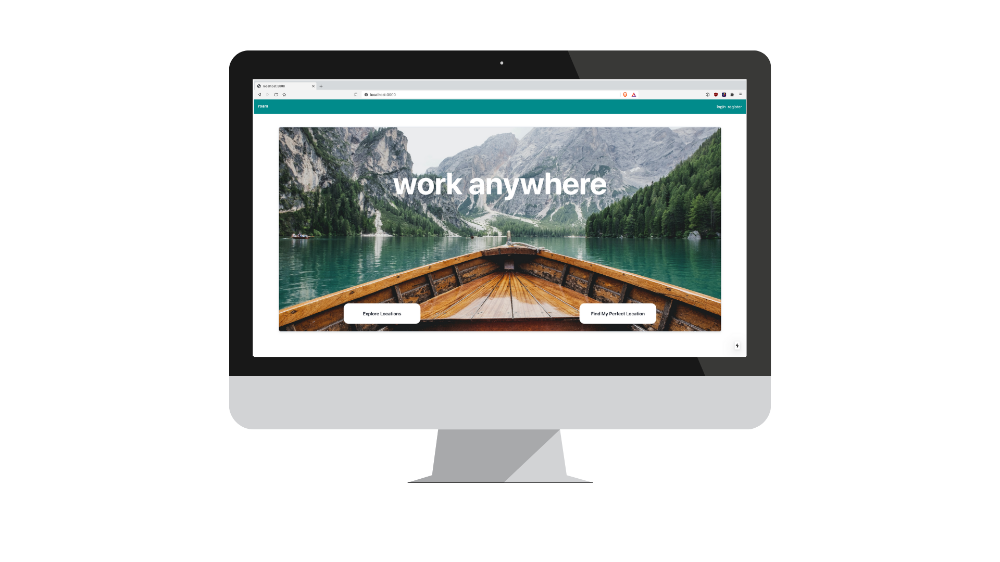
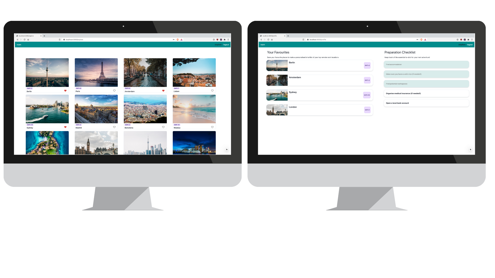

# Roam

Roam is a website to explore and compare different locations to live in as a remote worker and manage your move. 

## Main Features

- Browse & filter locations.
- Register and log in with username/password using session authentication.
- Save locations to your favourites.
- Manage a to-do checklist of important things to sort out before moving.

## Tech Stack

### Front End:

- React
- TypeScript
- Chakra UI
 
### Back End:

- Node.js
- GraphQL
- Apollo Server
- TypeORM
- PostgreSQL
- Redis

## Screenshots

